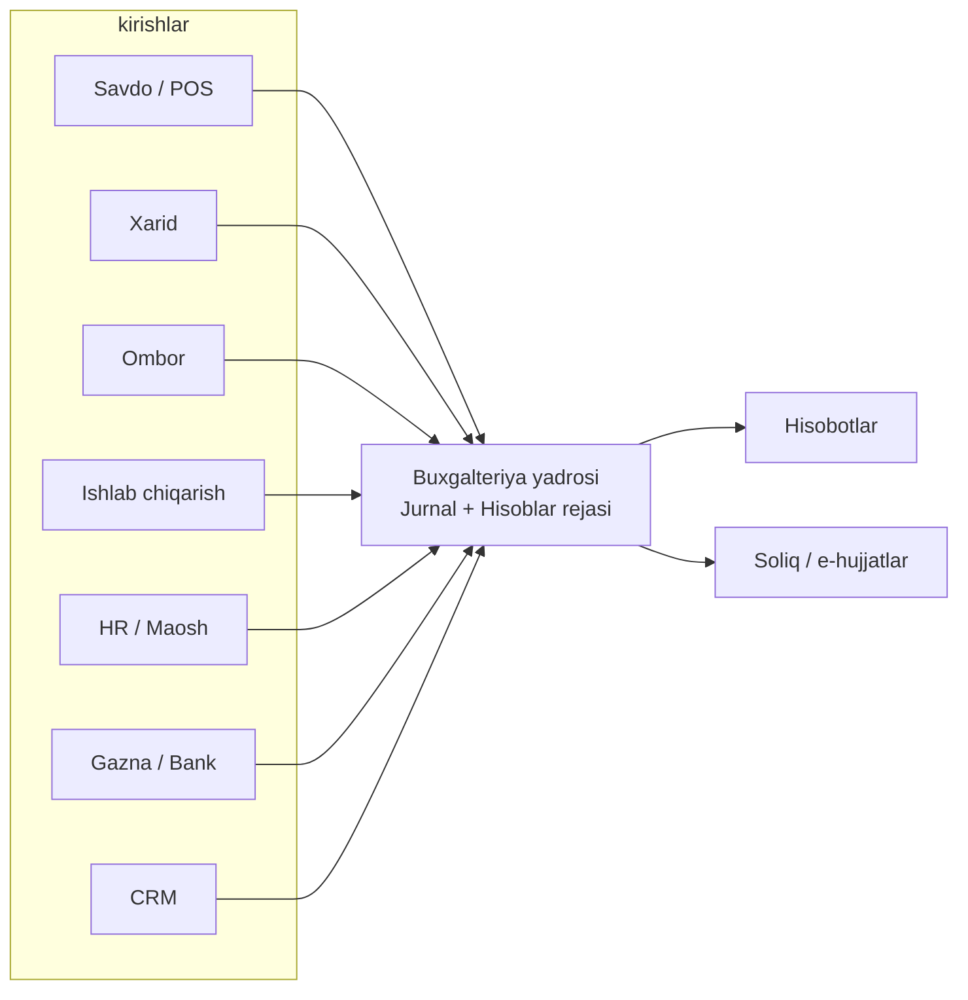
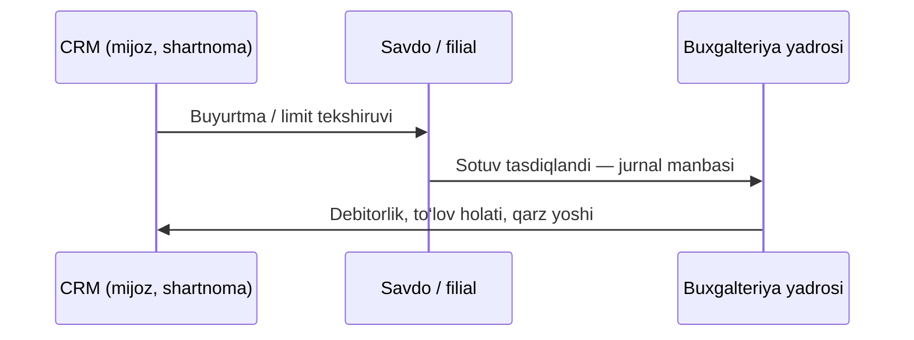

# Nonvoyxona ERP: Buxgalteriya moduli

**Maqsadli texnik spetsifikatsiya, bo‘limlar, imkoniyatlar va CRM integratsiyasi**

| Maydon | Qiymat |
|--------|--------|
| **Versiya hujjati** | v1.0 (loyiha bilan sinxron) |
| **Standartlar** | O‘zbekiston MHXS tamoyillari, IFRS bilan moslashuvchan dizayn |
| **Maqsadli stack** | Django 6.x, PostgreSQL 15+, Redis, Celery (moliyaviy yuk uchun) |
| **Hozirgi kod holati** | `accounting` ilovasida soddalashtirilgan kassa/tranzaksiya modellari; to‘liq ikki tomonlama buxgalteriya — keyingi bosqich |

Ushbu hujjat sizning **v4.0 Premium** arxitektura tasviri bilan uyg‘un holda, buxgalteriya modulining **mukammal (maqsadli)** tuzilmasi, har bir bo‘limning vazifalari va **CRM** bilan birgalikda qanday imkoniyatlar ochilishini batafsil qamrab oladi.

---

## 1. Hozirgi loyiha va maqsad oralig‘i

**Hozir (MyBakery kod bazasi):**

- `CashRegister`, `Transaction`, `Supplier`, `ExpenseCategory` — kassa harakati va soddalashtirilgan qarzdorlik.
- Asosiy ERP modullari: `sales`, `production`, `branches`, `hr`, `core`.

**Maqsad (ushbu hujjat bo‘yicha):**

- To‘liq **ikki tomonlama** jurnal tizimi, hisoblar rejasi, davr yopish, audit izi.
- **CRM** moduli hozircha bo‘sh — bu yerda uning **buxgalteriya bilan bog‘lanish nuqtalari** alohida belgilangan.

---

## 2. Buxgalteriya “yadrosi” va boshqa modullar oqimi

Maqsadli arxitekturada barcha moliyaviy hodisalar markaziy **JournalEntry / JournalLine** orqali o‘tadi; savdo, xarid, ombor, ishlab chiqarish, HR va g‘aznachilik faqat **hodisa generatorlari** bo‘lib qoladi.

---

## 3. Mukammal bo‘limlar: nima qiladi va qanday imkoniyatlar

Quyidagi jadval har bir **maqsadli bo‘lim** uchun: asosiy vazifa, asosiy funksiyalar va tizim darajasidagi kafolatlar.

### 3.1 Hisoblar rejasi (Chart of Accounts)

| Yo‘nalish | Imkoniyatlar |
|-----------|----------------|
| **Maqsad** | Barcha moliyaviy olaylar yagona ierarxik hisoblar daraxtida aks etadi. |
| **Funksiyalar** | Hisob kodlari (1000–5999 diapazoni), tur (aktiv, majburiyat, kapital, daromad, xarajat), ota-bola bog‘lanish, `normal_balance` (debet/kredit normal qoldiq). |
| **Hisoblash** | Hisob bo‘yicha qoldiq: aktivlar uchun \(D - K\), majburiyat/kapital/daromad uchun \(K - D\), xarajatlar uchun \(D - K\) mantig‘i. |
| **Nazorat** | Yangi hisob ochish huquqi rollar bilan; yopiq davrlarda o‘zgartirish taqiqlanadi. |

### 3.2 Jurnal va ikki tomonlama yozuv (Double-Entry Engine)

| Yo‘nalish | Imkoniyatlar |
|-----------|----------------|
| **Maqsad** | Har tranzaksiya **kamida ikki qator**: debet yig‘indisi = kredit yig‘indisi. |
| **Funksiyalar** | `JournalEntry` (sarlavha: sana, davr, manba hujjat, holat: draft/posted/locked), `JournalLine` (hisob, debet, kredit, izoh). |
| **Nazorat** | Ma’lumotlar bazasida **CHECK** cheklovi: `SUM(debit) = SUM(credit)`; bitta atomik tranzaksiyada saqlash. |
| **Bekor qilish** | Hard delete emas — **storno / reversal** yozuvi bilan bekor qilish; audit izi saqlanadi. |

### 3.3 G‘aznachilik va bank (Treasury)

| Yo‘nalish | Imkoniyatlar |
|-----------|----------------|
| **Maqsad** | Naqd, terminal, bank hisoblarining birlashtirilgan ko‘rinishi va harakatlari. |
| **Funksiyalar** | Kassa/bank hisoblari, ichki o‘tkazmalar, valyuta (keyingi bosqich), limitlar. |
| **Bank reconciliation** | Bank ko‘chirmasi import (CSV/API), avtomatik moslashtirish (summa, sana, referens), qo‘lda tasdiqlash, mos kelmaydigan qatorlar (komissiya va hokazo). |

**Hozirgi kod bilan bog‘liqlik:** mavjud `CashRegister` / `Transaction` keyinchalik jurnal yozuvlariga “yumshoq” migratsiya qilinadi yoki parallel ishlaydigan vaqtinchalik qatlam bo‘lishi mumkin.

### 3.4 Kreditorlik (Accounts Payable) va 3-way matching

| Yo‘nalish | Imkoniyatlar |
|-----------|----------------|
| **Maqsad** | Yetkazib beruvchiga to‘lov faqat hujjatlar zanjiri tasdiqlangach. |
| **Funksiyalar** | Xarid buyurtmasi (PO), omborga qabul (GRN), yetkazib beruvchi schyot-fakturasi; **uch tomonlama moslik**: miqdor va narx tafovutlari bloklov yoki tasdiq zanjiriga tushadi. |
| **Buxgalteriya effekti** | To‘lov: masalan `Dr 2101 Kreditorlik | Cr 1102 Bank`; avans va qarz hisobi alohida kuzatiladi. |

### 3.5 Debitorlik (Accounts Receivable)

| Yo‘nalish | Imkoniyatlar |
|-----------|----------------|
| **Maqsad** | Ulgurji va kredit savdodagi qarz va undirish. |
| **Funksiyalar** | Mijoz bo‘yicha limit, qarz yoshi (aging 0–30, 31–60, 60+), eslatmalar, to‘lov rejalari. |
| **Buxgalteriya effekti** | Sotuv: `Dr 1201 Debitorlik | Cr 4101 Daromad + QQS`; to‘lov kelganda debitorlik kamayadi. |

### 3.6 Ombor va inventar (FIFO / o‘rtacha)

| Yo‘nalish | Imkoniyatlar |
|-----------|----------------|
| **Maqsad** | Xom ashyo va tayyor mahsulot tannarxining ishonchli manbai. |
| **Funksiyalar** | Partiyalar bo‘yicha FIFO yoki vaznli o‘rtacha; inventar qayta baholash; filiallararo o‘tkazmalar bilan buxgalteriya “transit” hisoblari. |
| **Bog‘lanish** | Ombor harakati — avtomatik jurnal (masalan chiqim: `Dr COGS | Cr Tayyor mahsulot`). |

### 3.7 Ishlab chiqarish tannarxi

| Yo‘nalish | Imkoniyatlar |
|-----------|----------------|
| **Maqsad** | WIP, mehnat, ustamalar, tayyor mahsulot va COGS aniq ajratiladi. |
| **Funksiyalar** | Retseptura asosida xom ashyo sarfiyati, brak alohida xarajat hisobiga, zaxira va rejalashtirilgan tannarx tafovuti. |

### 3.8 HR va maosh buxgalteriyasi

| Yo‘nalish | Imkoniyatlar |
|-----------|----------------|
| **Maqsad** | Yalpi maosh, ushlab qolishlar, ish beruvchi soliqlari, to‘langan maosh. |
| **Funksiyalar** | Payroll jurnali: `Dr 5200 xarajat | Cr 2100 majburiyatlar | Cr 1100 kassa`; INPS va boshqa majburiyatlar alohida qatorlar. |

**Integratsiya:** mavjud `hr` modulidagi `Payroll`, `AdvancePayment` ma’lumotlari jurnal manbasi sifatida ishlatiladi.

### 3.9 Asosiy vositalar va amortizatsiya

| Yo‘nalish | Imkoniyatlar |
|-----------|----------------|
| **Maqsad** | Aktiv modulida eskirish avtomatik yuritiladi. |
| **Funksiyalar** | Celery bilan oy boshida: `Dr Amortizatsiya xarajati | Cr Jamg‘arilgan amortizatsiya`. |

### 3.10 Soliq va elektron hujjatlar (maqsadli)

| Yo‘nalish | Imkoniyatlar |
|-----------|----------------|
| **Maqsad** | QQS, e-faktura, byudjetga to‘lanadigan soliq hisob-kitobi. |
| **Funksiyalar** | Kirim/chiqim QQS registrlari, DSQ API integratsiyasi (loyiha bosqichiga qarab). |

### 3.11 Davr yopish (Period closing)

| Yo‘nalish | Imkoniyatlar |
|-----------|----------------|
| **Maqsad** | Yopilgan oyga yangi yozuv kiritish mumkin emas (faqat storno ruxsati bilan). |
| **Funksiyalar** | Tekshiruv ro‘yxati: barcha hujjatlar post qilingan, bank solishtirilgan, amortizatsiya hisoblangan; direktor tasdig‘i bilan qulf. |

### 3.12 Moliyaviy hisobotlar

| Hisobot | Tavsif |
|---------|--------|
| **Sinov balansi** | Barcha hisoblar bo‘yicha debet/kredit va saldo. |
| **Foyda va zarar** | Daromad va xarajat guruhlari bo‘yicha davr natijasi. |
| **Balans** | Aktiv = Majburiyat + Kapital tekshiruvi. |
| **Pul oqimi** | Operatsion / investitsion / moliyaviy bo‘limlar. |

### 3.13 Byudjet va variance

| Yo‘nalish | Imkoniyatlar |
|-----------|----------------|
| **Maqsad** | Reja vs fakt, ogohlantirishlar, filial/korxona darajasida limit. |

### 3.14 Ko‘p filial buxgalteriyasi

| Yo‘nalish | Imkoniyatlar |
|-----------|----------------|
| **Maqsad** | Har filial alohida yuritiladi, markaz konsolidatsiya hisobot beradi. |
| **Bog‘lanish** | Mavjud `branches.Branch` va filial sotuvlari markaziy jurnalga manba bo‘lishi mumkin. |

### 3.15 Audit izi va RBAC

| Yo‘nalish | Imkoniyatlar |
|-----------|----------------|
| **Maqsad** | Kim, qachon, nima o‘zgartirdi; eski va yangi qiymat. |
| **Funksiyalar** | `AuditLog`, yozuvlar faqat bekor qilish orqali; superuser va rollar: kassir, buxgalter, direktor, auditor. |

---

## 4. CRM va buxgalteriya: qanday integratsiya mumkin

CRM moduli hozir bo‘sh — quyidagi integratsiyalar **nonvoyxona B2B savdosi** va xizmat ko‘rsatish uchun eng yuqori qiymat beradi.

### 4.1 Mijoz va shartnoma (CRM → Buxgalteriya)

| Imkoniyat | Buxgalteriya effekti |
|-----------|----------------------|
| Har bir mijoz (restoran, do‘kon, tarmoq) CRM da **kredit limiti** va to‘lov shartlari | Kredit limiti oshganda yangi yetkazib berish (waybill) bloklanadi; debitorlik limiti bilan sinxron. |
| Shartnoma narxi, chegirma, bonus shartlari | Savdo hujjatlarida avtomatik tarif; daromad va QQS qatorlari to‘g‘ri hisobga tushadi. |
| Shikoyat / qaytarish (RMA) CRM orqali | `ReturnLog` va pul qaytarish yoki kredit-nota — reversal jurnal yozuvlari. |

### 4.2 Sotuv va undirish (CRM + AR)

| Imkoniyat | Tavsif |
|-----------|--------|
| **Aging hisobot** CRM dashboardda | Buxgalteriyadagi debitorlik ma’lumotlari mijoz kartasida ko‘rinadi. |
| **To‘lov va’dalari** | CRM da kalendar; kechikkan to‘lov — avtomatik eslatma va (ixtiyoriy) blokirovka. |
| **Kontakt markaz** | Qo‘ng‘iroq/yozishma loglari mijoz bilan kelishilgan to‘lov rejasini tasdiqlash uchun. |

### 4.3 Lid va marketing (CRM)

| Imkoniyat | Buxgalteriya bilan bog‘liqlik |
|-----------|------------------------------|
| Marketing kampaniya byudjeti | Byudjet modulida “marketing” hisobiga reja; haqiqiy xarajat — jurnal orqali. |
| Lid konversiyasi | Birinchi buyurtma — mijozni debitorlik hisobiga ulash; LTV hisob-kitobi uchun daromad ma’lumotlari. |

### 4.4 Yetkazib berish va logistika (CRM / savdo)

| Imkoniyat | Buxgalteriya effekti |
|-----------|----------------------|
| Yetkazib berish yo‘li va marshrut | Yoqilg‘i va haydovchi xarajatlari filial/korxona hisobiga taqsimlanadi. |
| Yuk xatlari | Faktura va QQS bilan bir vaqtda yopiq zanjir. |

### 4.5 Ma’lumot oqimi (maqsadli)

---

## 5. Texnik talablar (maqsadli stack bilan)

| Talab | Izoh |
|-------|------|
| **PostgreSQL** | Moliyaviy tranzaksiyalar uchun tavsiya etiladi; yuqori izolyatsiya rejimlari murakkab jurnallar uchun. |
| **ACID** | `JournalEntry` saqlanishi bitta DB tranzaksiyasida. |
| **Celery + Redis** | Amortizatsiya, massa hisobotlar, bank import. |
| **SQLite** | Faqat dastlabki ishlab chiqish; prod uchun hujjatdagi kabi fayl bazasidan voz kechish tavsiya etiladi. |

---

## 6. Amalga oshirish bosqichlari (tavsiya)

1. **Bosqich A:** Hisoblar rejasi + JournalEntry/JournalLine + posting qoidalari.  
2. **Bosqich B:** Savdo va filial sotuvlaridan avtomatik jurnal shablonlari (QQS bilan).  
3. **Bosqich C:** AP/AR, bank reconciliation.  
4. **Bosqich D:** CRM modellari (mijoz, shartnoma, limit) va debitorlik chuqur integratsiyasi.  
5. **Bosqich E:** Soliq API, byudjet, konsolidatsiya.

---

## 7. Xulosa

Ushbu hujjat **maqsadli** buxgalteriya modulining to‘liq konturini beradi: ikki tomonlama yozuvdan tortib bank solishtirish, 3-way matching, FIFO tannarx, davr yopish va auditgacha. **CRM** esa mijoz, kredit, undirish va marketing xarajatlarini markaziy moliya bilan birlashtirish orqali nonvoyxona B2B operatsiyalarini boshqarish imkonini beradi.

Hozirgi kod bazasida bu yo‘nalishda birinchi qadam — mavjud `accounting` va `sales`/`branches`/`hr` modellarini kelajakdagi `JournalEntry` manbalariga to‘g‘rilash va PostgreSQL ga o‘tish strategiyasi.

---

*Hujjat loyiha repozitoriyasi bilan birga yangilanadi. © 2026*
